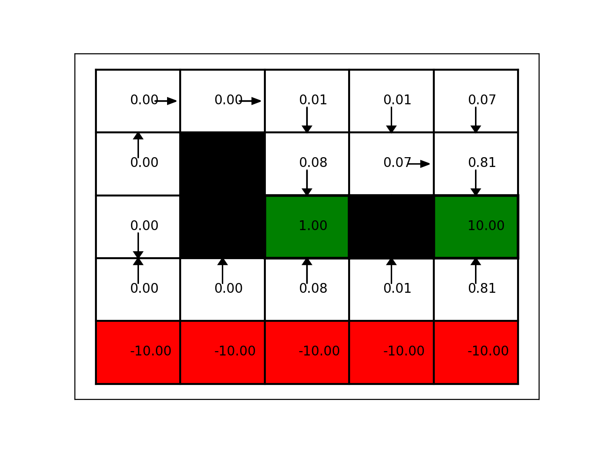
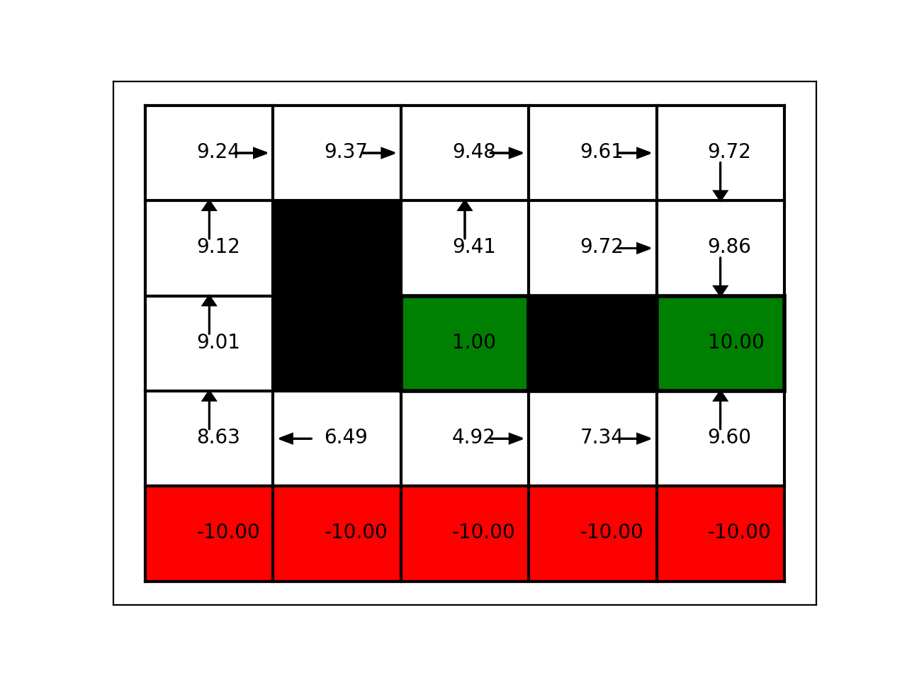

# Homework 4

## Tyler Amos

6 June 2019

# 1a

# 1b

Assuming policies do not vary with time, the number of possible policies is therefore the set of all possible actions $a \in A$ in all possible states $s \in S$. The size of this set is therefore the size of $A, n_A$ times the size of $S, n_S$, and the set of possible policies can be represented as an $n_A \times n_S$ matrix.

# 1c

Consider the requirements for demonstrating convergence via policy iteration. First, we must show the algorithm accounts for information about the current state's value which it does through the $V^{\pi \prime}$ term. Second, we must show the algorithm incorporates information about the impact of future actions. This is done through the $Q$ function, which is the expected rewards of future states given the current policy, weighted by the likelihood of the future state given the current state and policy. By acting greedily over the $Q$ function, the algorithm is able to approach the optimal policy because the $Q$ function encodes information about the potential future action. Third, we must show the algorithm will consider all possible policies in its exploration. This is guaranteed by the fact that the algorithm considers all possible actions in the policy improvement step by summing over $a \in A$, where $A$ is the set of all possible actions for the agent to take.

# 2a

# 2b

These two policies differ in their discounting factor. The first (i) is highly myopic, while the second (ii) is very farsighted. This means under the first policy, the agent will prioritize short-term rewards. This leads to, for example, the cautious policy in the second row from the bottom. In all of these cells, the agent pursues the policy of moving upwards. By always going upward only, the agent avoids catastrophic outcomes in the bottom row.

By contrast, in the second policy the agent engages in more 'risk-taking' behaviour by moving left and right (east/west) in the second row. This runs the risk of entering the cliff in the bottom row. However, if the agent does not end up going off the cliff, the potential rewards are greater.

I find these results to be quite interesting because my initial intuition was actually quite the opposite. I thought an agent which values their future more (i.e., is more farsighted) would always try to move upward in the bottom row - this guarantees they will not fall off the cliff. This would be a very risk-averse strategy. It is interesting then that the farsighted agent may pursue a riskier strategy than the myopic agent.

At the same time, the logic of the agents' planning choices are clear. The myopia of the first agent likely leads it to 'worry' excessively about the risk posed by the cliff in the bottom row. This leads it to adopt a very cautious strategy of only moving upwards, which guarantees it will never fall over the cliff. The more farsighted agent still accounts for the risks of the cliff, but tries to benefit from the rewards in the other parts of the environment.

\newpage

# 2c

It would appear more farsighted agents require more iterations to converge upon a policy (28) than more myopic agents (5).

Agents who have a greater amount of noise also appear to take longer to converge (58) than those with less noise (28). This is logical as estimates of potential rewards which are less certain (i.e., more noisy) will take longer to converge to a global optimum.

# 2d

From 14.5 in Probabilistic Robotics, note the payoff can be written as the sum of a geometric series, so the difference between the current payoff and the optimal payoff can be written as:

$$ \Sigma_{i = 0}^{inf} || r_{{current}_i} - r_{{max}_i} || $$

Now we know that sequential differences between value functions are less than $\epsilon$, so we can reformulate this as:

$$ \Sigma_{i = 0} ^{inf} \epsilon_{\delta} $$

Where $\epsilon_{\delta}$ is a difference of $\epsilon$, or equivalently $2 \epsilon$.

Since $\epsilon$ is the reward, or rather the improvement in the reward, it must also be discounted with a $\gamma$ term. We take the above summation and express it with the standard limit of a geometric series formula:

$$ \frac{a}{1-r} = \frac{2\epsilon \gamma }{1 - \gamma} $$

\newpage

# 3

For batch TD(0), we can consider the episodes as a Markov process, and from there back out the value function. Since 6 out of 8 times we are in state $y$ we receive a reward of 1, we can say the value of state $y$ is 0.75. Every time we are in state $x$, which is just once, we receive no reward, but we do transition to state $y$, which has a value of 0.75.  

If we were to take a Monte Carlo approach, we might note that when we are in state $x$ we never receive any reward. So the expected reward from $x$ is 0.

While the MC method would produce the lowest mean squared error, it would not generalize as well as the TD method (SB pp 127-129). This is because the TD method would allow us to approximate the true underlying process as a Markov model with the maximum likelihood estimation of the parameters. SB (pp 129) notes that by assuming the maximum likelihood estimate of the model parameters is close enough to the true parameters, we are able to identify the "true" value function. TD also has the advantage of being much more efficient to compute than MC methods.

\newpage

# 4a

I did not work with anyone on this problem set.

# 4b

I spent approximately 5 hours on this problem set.
